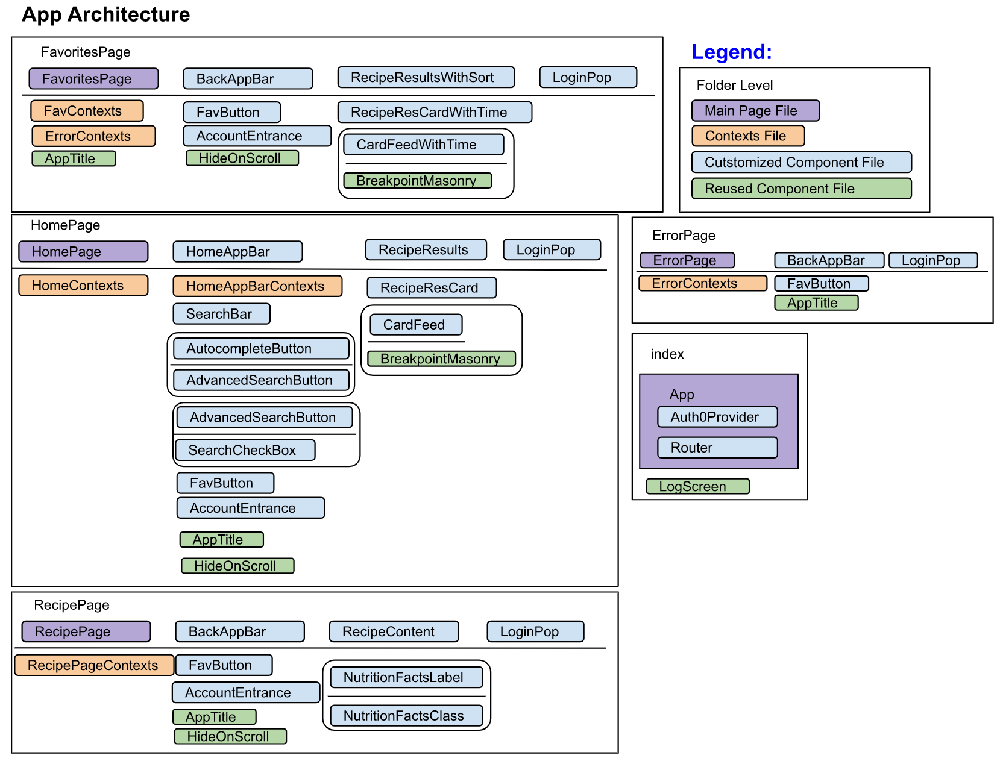
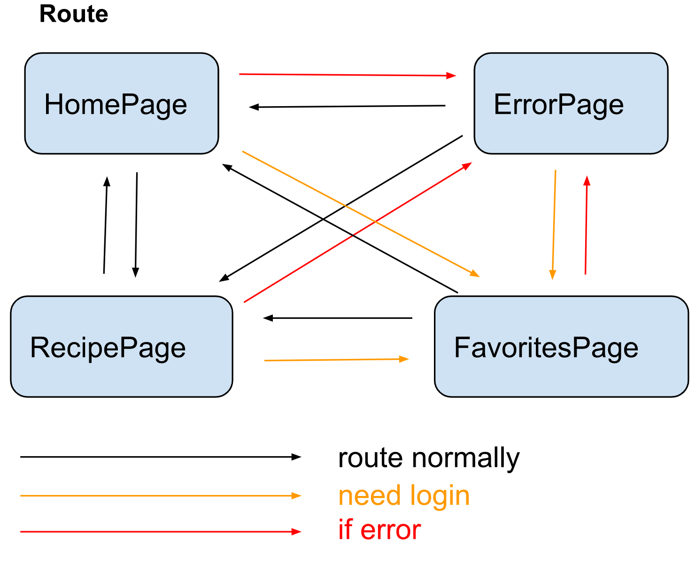

# Bruin Taste

A website that can search for UCLA menu recipes can also provide collection function after login.  
[BruinTaste](https://bruintaste.web.app/)

## Background

Due to COVID-19, many UCLA students can't continue to enjoy the meals in residential restaurants. This website gives an inspiration to those who would like to recreate the flavor of UCLA recipes.  

## Project Architecture

The architecture of the app:

The route of the app:

## Acknowledgment

Answer contributors on Stack Overflow
